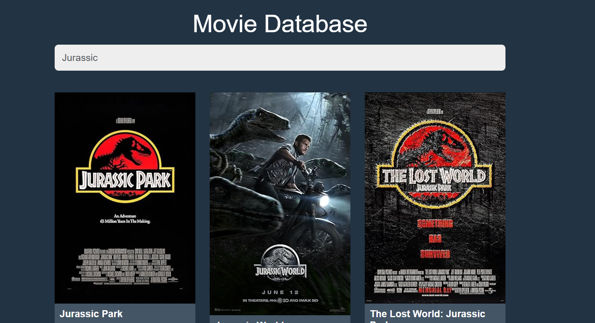
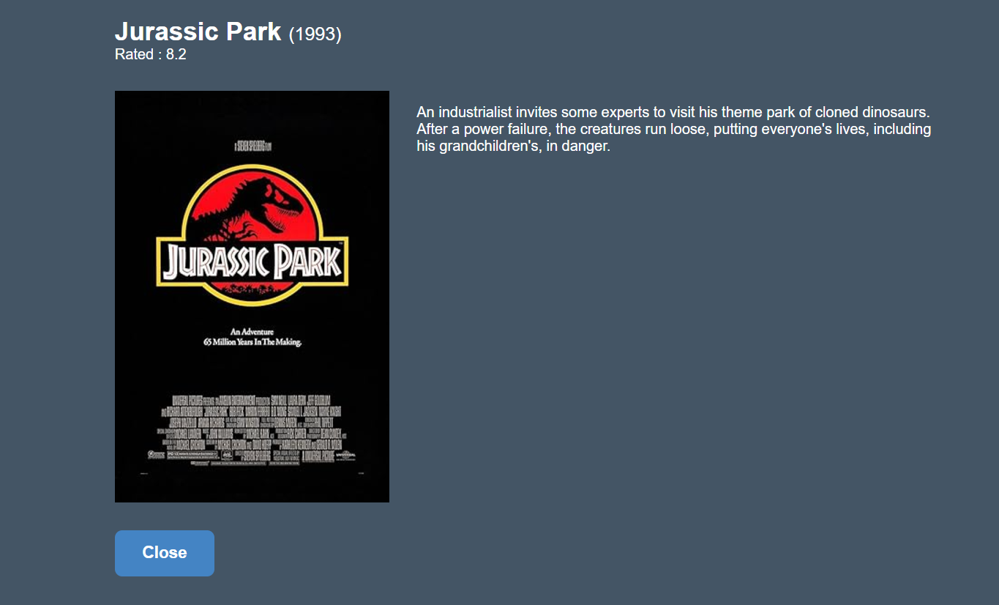

# 🎥 imDbMovie App

**imDbMovie** is a sleek and user-friendly movie search app that allows you to explore movie details, including release date, rating, plot, and more! Powered by the [OMDb API](https://www.omdbapi.com/), imDbMovie is your gateway to discovering and learning about your favorite films in seconds.

---

## 🚀 Features

- 🔍 **Search Movies**: Instantly search for movies by their title.
- 📅 **Release Date**: Check when your favorite movies hit the screens.
- ⭐ **Ratings**: View IMDb ratings for each movie.
- 📝 **Plot Summary**: Get a quick synopsis of the movie.
- 🎭 **Genre**: Explore the genre of the movie.
- 🎬 **Director & Cast**: Learn about the team behind the movie.

---

## 🛠️ Tech Stack

- **Frontend**: HTML, CSS, ReactJS
- **API**: [OMDb API](https://www.omdbapi.com/)
- **Hosting**: [GitHub Pages](https://pages.github.com/) (optional)

---

## 📸 Screenshots

### Movie Search Page


### Movie Details Page


---

## ⚙️ Installation

1. Clone the repository:
   ```bash
   git clone https://github.com/your-username/imDbMovie.git
   cd imDbMovie
